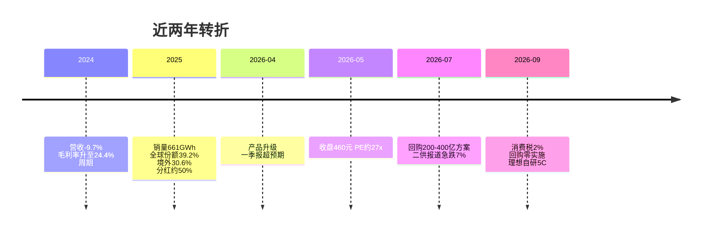
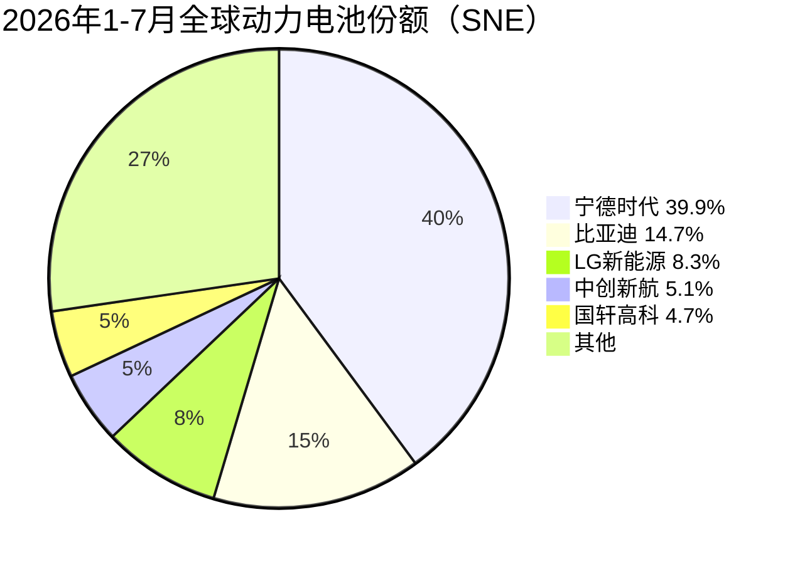
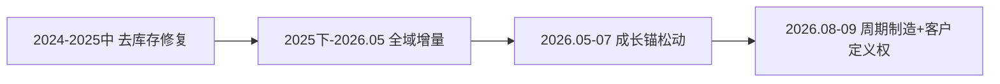

# 宁德时代（300750）投研报告

> 财务时点 2026-06-30；行情 2026-09-10（339.18 元 / 市值 1.57 万亿）；催化 2026-09-10。  
> 框架 value-leader-research 1.9.0。表图为主的合订本；证据见 `01`～`09` 与 `data/`。[回总览](./00-总览.md)  
> **不构成投资建议，不给出目标价或买卖指令。**

## 一句话判断

质量仍硬、中性利润三年 CAGR 约 19%、估值处自身历史约 13% 分位（PB-ROE 5.7%）；市场已按周期制造定价，买方议价与去宁化改的是利润率中枢，不是明天份额归零。

---

## 一、投资摘要

**匹配：质量与估值匹配，成长假设必须打折。** 主要矛盾是利润表与定价表分裂。

```mermaid
xychart-beta
    title 营收与归母净利（亿元）
    x-axis [2021, 2022, 2023, 2024, 2025, 2026H1]
    y-axis 亿元 0 --> 4500
    bar [1304, 3286, 4009, 3620, 4237, 2769]
    line [159, 307, 441, 507, 722, 433]
```

读法：柱为营收、线为归母。2024 年量价周期让营收回落、利润仍增；2026H1 利润已达 2025 年的 60%，但毛利率已从 26.3% 降到 23.9%。

| 项目 | 2023 | 2024 | 2025 | 2026H1 |
|------|------|------|------|--------|
| 营收（亿元） | 4009 | 3620 | 4237 | 2769 |
| 营收同比 | +22.0% | −9.7% | +17.0% | +54.8% |
| 归母净利（亿元） | 441 | 507 | 722 | 433 |
| 归母同比 | +43.6% | +15.0% | +42.3% | +42.0% |
| 毛利率 | 19.2% | 24.4% | 26.3% | 23.93% |
| 粗算 FCF（亿元） | 592 | 658 | 909 | 351 |

| 快照 | 数值 |
|------|------|
| PE TTM / PB | 18.46 / 4.21 |
| 前向 PE（一致预期 2026E EPS 20.77） | 16.3 倍 |
| 本报告中性 2025–28 净利 CAGR / PEG | ~19% / ~0.9 |
| 自 5/6 高点回撤 | −27% |

| 乐观 | 谨慎 |
|------|------|
| 全球份额 39%→近 40%，国内 H1 装车 46% | 高端订单被自研/二供点状抽走，毛利比销量更敏感 |
| 储能 H1 +88%，境外收入 2025 年 30.6% | 动力/储能毛利率同比均降；消费税 2% |
| FCF 覆盖分红；ROE 不靠加杠杆 | 400 亿回购至 8/31 零实施 |
| PE/PB 五年约 13% 分位 | 7 月卖方「回购彰显信心」与 8–9 月定价背离 |

---

## 二、基本面

生意：电池系统规模化制造差价；大客户招标。2025 年销量 661GWh；销售费用约占收入 0.9%。不是品牌消费品，也不是轻资产平台。

### 2026H1 收入结构

| 分部 | 收入（亿元） | 同比 | 毛利率 | 毛利率同比 |
|------|-------------|------|--------|------------|
| 动力电池系统 | 1921 | +46% | 20.63% | −1.78ppt |
| 储能电池系统 | 533 | +88% | 23.96% | −1.56ppt |
| 材料/回收/矿产 | 188 | +67% | 27.04% | +5.81ppt |
| 合计 | 2769 | +54.8% | 23.93% | −1.09ppt |

读法：动力仍是压舱石（约 69%），储能是弹性；两大主业毛利率都在让利。2025 年境内/境外约 69% / 31%。

### 杜邦与现金

| | 2024 | 2025 | 2026H1 |
|--|------|------|--------|
| 净利率 | 14.0% | 17.0% | 15.6% |
| 加权 ROE | 24.13% | 24.91% | 12.08%（半年） |
| 权益乘数（期末平均，估） | ~3.4 | ~3.0 | — |
| 经营现金流（亿元） | 970 | 1332 | 602（同比仅 +2.6%） |
| 粗算 FCF（亿元） | 658 | 909 | 351 |

2025 年杜邦：净利率 17% × 周转约 0.48 × 乘数约 3.0 ≈ 24.7%。**高 ROE 来自利润率，不是加杠杆。** H1 最大裂口是现金转化：利润 +42%，CFO 几乎走平。

| 资产负债（2026-06-30） | 亿元 |
|------------------------|------|
| 货币资金 | 3721 |
| 有息债务（短贷+长贷+债券） | 1237 |
| 粗算净现金 | 2484 |
| 存货 / 应收 / 应付 | 1308 / 884 / 2025 |
| 合同负债 | 365（2025 末 492） |
| 资产负债率 | 63.7% |

存货升更像备货（周转天数约 110 天）；应付远大于应收，是上游账期优势。扣非约占归母九成。

| 强项 | 隐患 |
|------|------|
| 份额+净利率驱动的 ROE | Q2 起以量换价 |
| 2023–25 年 FCF > 净利 | H1 现金转化明显变弱 |
| 净现金、利息保障约 40 倍 | 利润率上限由大客户招标决定 |

---

## 三、近 1–2 年重大变化

结构三件事：海外+储能成为增量；利润率 2023 谷→2025 高→2026H1 再被压；资本配置转向高分红，但回购未兑现。



| 时间 | 事件 | 周期 / 结构 |
|------|------|-------------|
| 2024 全年 | 价跌量平，利润率修复 | 周期 |
| 2025 全年 | 出海、储能、分红上台阶 | 结构 |
| 2026H1 | 份额升、毛利率降、利用率 94.9% | 结构量 + 周期价 |
| 2026-07-24 | 回购方案，上限 573 元 | 资本配置（结构） |
| 2026-09-03 | 截至 8/31 **零股** | 承诺未兑现 |
| 2026-09-07 | 理想 MEGA 改自研 5C | 客户结构 |

已被定价：2024 底部、2025 利润、2026Q1。仍在交易：高端分流、回购空窗、Q3 毛利率、海外工厂。

---

## 四、竞争格局与护城河

**评级：中等偏宽。** 寡头市场，进入壁垒高，但巨头与车企之间仍在肉搏。



| 口径 | 宁德 | 比亚迪 | 集中度 |
|------|------|--------|--------|
| 全球 2025 | 39.2% | 约宁德的 1/2.4 | 中国前十合计约 70% |
| 全球 2026 年 1–7 月 | **39.9%**（289.6GWh） | 14.7% | CR2 54.6%；CR5 ~73% |
| 国内 2026H1 装车 | **46.04%**（154.25GWh） | 17.14% | CR3 ~69%；CR5 ~81% |
| 储能 2025 | 30.4% | — | 连续五年第一 |

国内 H1 装车总量仅 +12%，宁德仍接近半壁。6 月单月份额曾回落到 42.7%，有排产波动。

| 五力 | 强度 | 含义 |
|------|------|------|
| 现有竞争 | 强 | 二线增速快于宁德，价格战压毛利率 |
| 潜在进入者 | 弱 | 资本开支+车规认证+专利 |
| 替代品 | 中偏强 | 固态非近端；**客户自研/多供才是近端替代** |
| 供应商 | 中 | 锂等可多供，金属周期仍在 |
| **购买者** | **强** | 电池占整车 BOM 30–40%；招标降价 |

| 2025 年 | 毛利率 | 净利率 | PE / PB（2026-09-10） |
|---------|--------|--------|----------------------|
| **宁德时代** | **26.3%** | **17.0%** | 18.5 / 4.21 |
| 亿纬锂能 | 16.2% | 6.7% | 18.6 / 2.16 |
| 国轩高科 | 16.2% | 5.3% | 13.6 / 1.55 |
| 欣旺达 | 13.9% | 1.7% | 39.6 / 1.32 |
| 比亚迪（集团） | 17.7% | 4.1% | 26.1 / 3.20 |

读法：利润率差是护城河兑现；宁德贵在 PB 而非 PE。变薄路径已可指名：理想自研 5C、鸿蒙智行国轩电芯、小米龙甲、消费税 2%、匈牙利工厂局部停工（媒体）。

---

## 五、成长性预测

行业：全球动力 2025 年 +32% → 2026 年 1–7 月 +20%；国内 H1 装车 +12%。储能高增降速。价：ASP 承压。产能：中低端过剩、龙头满产。

不把 H1 +55% 外推三年。中性全年营收约 5850 亿（+38%），毛利率约 23.5%–24.5%。

```mermaid
xychart-beta
    title 中性归母净利路径 vs 2025（亿元）
    x-axis [2025, 2026E, 2027E, 2028E]
    y-axis 亿元 0 --> 1500
    bar [722, 917, 1073, 1223]
```

| 年度 | 行业收入增速（中性） | 公司收入增速 | 公司归母增速 | 中性归母（亿元） |
|------|----------------------|--------------|--------------|------------------|
| 2026 | +18%～25% | +38% | +27% | ~917 |
| 2027 | +12%～18% | +16% | +17% | ~1073 |
| 2028 | +10%～15% | +12% | +14% | ~1223 |

| 对照 | 2026 净利 | 2025–28 CAGR |
|------|-----------|----------------|
| 同花顺一致预期（39 家） | ~961 亿（EPS 20.77） | ~26% |
| 本报告中性 | ~917 亿 | **~19%** |

差在利润率中枢与客户结构，不差在今年出货。乐观：毛利率守住 25% + 回购落地。悲观：国内份额 <40%、动力毛利率 <18%。

---

## 六、现阶段估值

| 尺子 | 数值 | 相对什么 |
|------|------|----------|
| 现价 / 市值 | 339.18 元 / 15693 亿 | — |
| PE TTM / PE 静 / PB / PS | 18.46 / 18.13 / 4.21 / 2.99 | 高于沪深300（13.6），远低于创业板（55） |
| 五年 PE / PB 分位 | 12.5% / 13.0% | **相对历史：偏低** |
| 5/6 高点 PE / PB | ~26.9 / 5.96 | 回撤首先是估值压缩 |
| 前向 PE 2026E / 2027E | 16.3x / 13.1x | 一致预期 |
| 本报告前向 / PEG | 17.1x / 0.89 | 用 19% CAGR |
| **PB-ROE** | **5.67%** | 23.85% / 4.21 |

五年加权 ROE：21.52% → 24.67% → 24.04% → 24.13% → 24.91%。PB/ROE ≈ 17.6x，与 PE TTM 18.5 同向，ROE 未被一次性损益扭曲。

若 19% CAGR 兑现，16–18 倍前向并不极端；毛利率若滑向悲观档，同一倍数会迅速变贵。

---

## 七、市场看法如何演变



| 阶段 | 主题 | 定价结果 |
|------|------|----------|
| 2024 初–2025 中 | 营收负增、利润率因锂价改善 | 周期底部 |
| 2025 下–2026-05 | 年报 722 亿、Q1 超预期、技术会 | 股价至 460，PE ~27x |
| 2026-05–07 | 资金向半导体；二供报道 | 7/10 单日 −7.12% |
| 2026-08–09 | 回购空窗、消费税、理想自研 | 低点 335 |

| 卖方（7 月仍） | 定价（8–9 月） |
|----------------|----------------|
| 东财 136 篇：买入 114、增持 22，无减持 | 中报高增 vs 股价 460→335 |
| 标题：出货高增、回购彰显信心 | 交易 2027–28 格局，而非 2026 出货 |
| EPS 20.77 / 25.88 / 31.07 未见下修快照 | 预期差：一致预期 CAGR ~26% vs 本报告 ~19% |

---

## 八、近期大涨 / 大跌归因

```mermaid
xychart-beta
    title 关键节点收盘价（元，不复权）
    x-axis [2025-09, 2026-05高, 2026-07-10, 2026-07-27, 2026-09-08]
    y-axis 元 300 --> 480
    line [316, 460, 349, 400, 335]
```

读法：不是阴跌一年，而是 5 月见顶后的估值压缩（PE ~27x → 18x）。

| 窗口 | 点位 | 幅度 |
|------|------|------|
| 阶段高点 | 2026-05-06 收 460 | — |
| 近端低点 | 2026-09-08 收 335.49 | 自高点 **−27%** |
| 8/5 以来 | 405 → 335 | −17% |
| 7/10 急跌 | 348.76 | **−7.12%**（二供报道） |

| 排序 | 主因 | 公司 / 板块 |
|------|------|-------------|
| 1 | **2026-09-07 理想汽车：新 MEGA 改自研 5C**（L8/L6/i8 已装） | 客户特有 |
| 2 | **2026-09-03 公告：回购截至 8/31 尚未实施** | 公司特有 |
| 3 | 成长股 → 周期制造的框架切换 | 公司 + 板块 |

7/10 是框架切换的第一次可指名冲击；9/8 是第二次。理想+小米或仅占国内装机约 13%–17%（媒体转述），打的是高端毛利结构。

弱化回撤：回购真实成交、Q3 毛利率止跌、国内月度份额 ≥45%。强化：更多自研时间表、回购持续空白。

---

## 九、综合判断与跟踪清单

**质量 × 成长 × 估值：质量与估值匹配，成长须打折。**

| 回扣 | 结论 |
|------|------|
| 护城河 | 中等偏宽 |
| 成长中性 | 营收 +38% / +16% / +12%；归母 +27% / +17% / +14% |
| 估值 | PE 分位 12.5%；PB-ROE 5.67% |
| 涨跌 | 中期杀估值；近端理想自研 + 回购零实施 |

| 中性前提 | 关键风险 |
|----------|----------|
| 全球动力 2026 年用量约 +20%，份额 ≥38% | 国内月度份额 <40% 并持续一季 |
| 全年毛利率 23.5%–24.5% | 动力毛利率 <18% 或综合 <21% |
| 海外工厂无长时间停产 | CFO 连续两季显著低于净利 |
| 储能继续快于动力 | 回购窗口过半仍接近零股 |

| 信号 | 看多确认 | 看空确认 |
|------|----------|----------|
| 2026 年报 | 营收 ≥~5850 亿、归母 ≥~900 亿、毛利率 ≥23.5% | 净利增速 <15% 且毛利率 <22% |
| 现金 | H2 CFO 追上利润 | 存货+应收继续快于收入 |
| 份额/客户 | 全球 ≥39%，国内月度中枢 ≥44% | 再出现理想级切换 |
| 回购 | 进展公告出现成交 | 窗口过半仍接近零股 |

第一次正式检验：2026 三季报与年报；月度装车联盟数据为高频代理。

---

本报告根据公开数据整理，供研究讨论。本框架不适配题材股、小市值股、亏损股。财务时点与催化检索时点不同，中报之后的客户与回购事件以公告和新闻为准。
