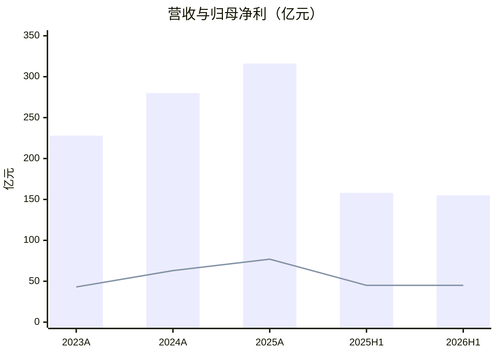
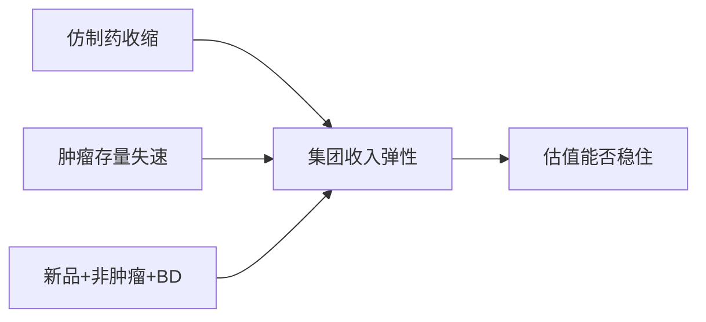

# 恒瑞医药（600276）投研总览

> 财务时点 **2026-06-30**；行情快照与催化检索时点 **2026-09-11**。  
> 框架 **growth-tech-research**；估值路由 **A**（已盈利，PE TTM 36.65 / Forward PE 30.3 均 ≤50）。  
> 数字与 [02](./02-生意模式与财务画像.md) 对齐。不构成投资建议，无目标价。

## 一句话判断

创新转型质地仍在，但 2026H1 增长与扣非失速已冲击「高增永续」叙事；估值处历史极低分位、Forward PE~30，属于成长待再验证的中性定价，而非深度价值。

## 关键指标

| 指标 | 数值 | 口径 / 时点 |
|------|------|-------------|
| 现价 / 总市值 | **42.67 元 / 2832.09 亿元** | 腾讯 2026-09-11 |
| PE TTM / 静态 PE / PB / PS | 36.65 / 31.71 / 4.39 / 9.04 | 同上；PS baostock |
| 5 年 PE / PB / PS 分位 | **~1.3% / ~0.1% / ~6.9%** | baostock |
| 2025A 营收 / 归母 / 扣非 | 316.29 / 77.11 / 74.13 亿 | +13.0% / +21.7% / +20% |
| 2026H1 营收 / 归母 / 扣非 | 154.56 / 44.65 / 37.30 亿 | −1.94% / +0.34% / **−12.71%** |
| 2026H1 CFO | 19.87 亿（**−53.8%**） | 新浪 |
| 货币资金 / 权益 / 负债 | 387.3 / 644.7 / 57.8 亿 | 2026-06-30 |
| 创新药销售 2025 / H1 | 163.42（58.34%）/ 88.09（63.16%） | 年报/中报 |
| 抗肿瘤创新 H1 | 62.65（**+2.58%**） | 中报 |
| 共识 EPS 26/27/28 | 1.41 / 1.65 / 1.96 | 同花顺 28 家 |
| Forward PE / PEG | **30.3 / ~1.69** | 现价/共识；CAGR≈17.9% |
| 自峰值回撤 | 72.47（2025-09-05）→42.67，**约 −41%** | baostock |
| 中报日 | 2026-08-20 收盘 49.5，换手 **3.74** | 近端导火索 |

## 关键图

读法：年度仍抬升，但 2026H1 营收已低于 2025H1，增长斜率转折；归母持平靠非经常，扣非更弱（见 02）。

## 单独报告

扫读请打开 [恒瑞医药-投研报告.md](./恒瑞医药-投研报告.md)（十一章合订、表图为主）。分册仍是证据主件；**02 已加厚，请勿用旧摘要覆盖其分部表。**

## 各章浓缩

| 章 | 结论 | 关键数字 | 分册 |
|----|------|----------|------|
| 摘要 | 质量尚可、成长承压、路由 A 中性定价 | 市值 2832 亿；PEG~1.69；回撤 −41% | [01](./01-投资摘要.md) |
| 生意与财务 | 高毛利创新平台；现金厚；H1 质量裂口 | 毛利率 ~86%；货币资金 387 亿；CFO/净利 0.44 | [02](./02-生意模式与财务画像.md) |
| 1–2 年变化 | 创新占比跨越为结构；H1 为验证受挫 | 58%→63%；8/20 中报事件 | [03](./03-近1-2年重大变化.md) |
| 行业与竞争 | 控费内卷；龙头靠产品周期 | 行业中性高个位数；市占精确值未取得 | [04](./04-行业空间与竞争格局.md) |
| 护城河 | 平台中等偏宽；单品易替代 | 五力：竞争/买方/替代强；肿瘤 GM 93.5% | [05](./05-护城河与能力壁垒.md) |
| 管理层/研发/资本 | 研发强度高，自我造血 | 研发费用 69.6 亿；H 股募资 102.85 亿 | [06](./06-管理层·研发组织·资本配置.md) |
| 成长路径 | 中性收入个位数，净利低双位数 | 2026 收入 +3～8%；净利 +10～22%；共识偏乐观 | [07](./07-成长路径与产品空间.md) |
| 估值 | 历史极低分位，相对增长中性 | Fwd PE 30.3；PEG 1.69；路径回推非目标价 | [08](./08-现阶段估值.md) |
| 市场看法 | 叙事从透支到再验证；卖方仍偏多 | 买入 47/中性 3；浦银中性、中邮肿瘤承压 | [09](./09-市场看法如何演变.md) |
| 涨跌归因 | 中期杀估值；近端点名中报 | 72.47→42.67；8/20 换手 3.74 | [10](./10-近期大涨大跌归因.md) |
| 综合跟踪 | 盯新品放量与扣非/CFO 修复 | 见跟踪表 | [11](./11-综合判断与跟踪清单.md) |

## 目录

1. [一、投资摘要](./01-投资摘要.md)
2. [二、生意模式与财务画像](./02-生意模式与财务画像.md)
3. [三、近 1–2 年重大变化](./03-近1-2年重大变化.md)
4. [四、行业空间与竞争格局](./04-行业空间与竞争格局.md)
5. [五、护城河与能力壁垒](./05-护城河与能力壁垒.md)
6. [六、管理层 · 研发组织 · 资本配置](./06-管理层·研发组织·资本配置.md)
7. [七、成长路径与产品空间](./07-成长路径与产品空间.md)
8. [八、现阶段估值](./08-现阶段估值.md)
9. [九、市场看法如何演变](./09-市场看法如何演变.md)
10. [十、近期大涨大跌归因](./10-近期大涨大跌归因.md)
11. [十一、综合判断与跟踪清单](./11-综合判断与跟踪清单.md)

原始数据：`data/research_raw.json` 及同目录抓取文件。  
**缺口（未取得）：** 统一口径市占/CR、品种峰值销售表、CapEx 精确序列、回购逐笔核销、部分 FDA 公告原文；sina 无完整分部时以年报分产品表为准（已写入 02）。
