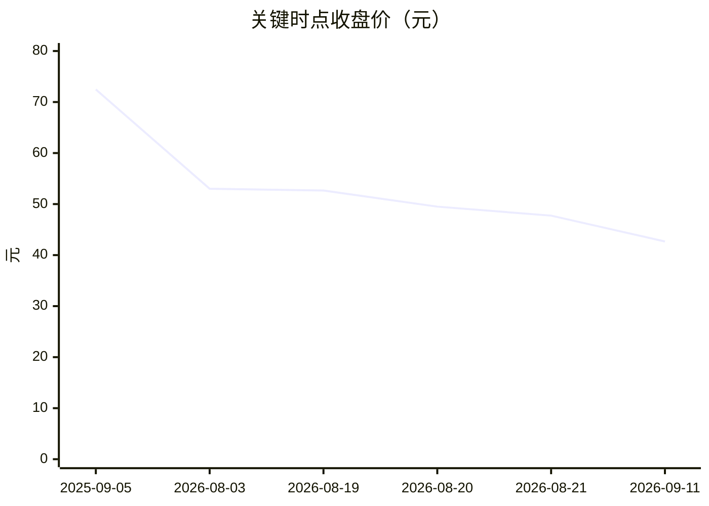

# 10. 近期大涨大跌归因｜恒瑞医药（600276）

> 本分册对应框架 Step 10。价格：baostock `price_path_400d.json`；催化：中报 + `web_catalyst_notes.md` + 新闻。  
> **必须分两层**；近端急跌须可指名事件。不做点位预测。不构成投资建议。

## 10.1 量化窗口

| 窗口 | 日期 | 收盘价 | PE TTM | 换手 | 备注 |
|------|------|--------|--------|------|------|
| 阶段高点（近 400 日样本最高） | **2025-09-05** | **72.47** | 65.40 | 1.47 | 乐观叙事峰值 |
| 近端观察起点 | 2026-08-03 | 53.00 | 43.33 | 0.97 | 中报前一月量级 |
| 中报前一交易日 | 2026-08-19 | 52.66 | 43.05 | 1.00 | — |
| **中报日（指名）** | **2026-08-20** | **49.50** | 42.52 | **3.74** | 单日约 −6.0%；换手跳升 |
| 中报次日 | 2026-08-21 | 47.74 | 41.01 | 2.00 | 续跌约 −3.6% |
| 卖方分化日 | 2026-08-24 | 46.76 | 40.17 | 1.35 | 浦银中性报告日 |
| 当前 | **2026-09-11** | **42.67** | **36.65** | 1.26 | 腾讯/baostock 一致 |

| 回撤度量 | 幅度 |
|----------|------|
| 自峰值 72.47 → 42.67 | **约 −41.1%** |
| 自 2026-08-03 的 53.00 → 42.67 | **约 −19.5%** |
| 中报两日（8/19→8/21） | 52.66→47.74，约 **−9.3%** |
| PE 压缩 | 峰值 ~65 → 当前 ~37 |

读法：中期是估值与叙事回归；近端陡坡从 **8/20 中报日**开始，换手 3.74 是事件日指纹。

## 10.2 两层归因（禁止混谈）

### A 层 · 中期（约 2025Q4–2026Q3）：定价框架如何切换

| 排序 | 主因 | 公司特有 / 板块 | 证据 |
|------|------|-----------------|------|
| 1 | 高估值对增长斜率极度敏感；「创新高增溢价」透支后均值回归 | 公司特有为主 | 峰值 PE~65 → 37；回撤 −41% |
| 2 | 仿制药持续负增，集团收入弹性过度依赖创新与 BD | 公司特有 | H1 仿制药 −16.07%；许可 −28.6% |
| 3 | 医药成长股风险偏好与同业竞争加剧 | 板块为辅 | 需对照同业，但恒瑞回撤幅度显著 |

**A 层一句话：** 市场从交易「转型成功溢价」切到交易「增长再验证」——框架切换发生在利润表仍赚钱之时。

### B 层 · 近端（中报前后至 2026-09）：导火索必须可指名

| 日期 | 主体 | 摘要 | 预期差类型 | 公司特有/板块 |
|------|------|------|------------|---------------|
| **2026-08-20** | **本公司** | 披露 2026 中报：营收 **−1.94%**，归母 **+0.34%**；媒体强调扣非 **−12.71%**、Q2 更弱（Q1 仍 +13%/+22%） | **不及预期** | **公司特有** |
| 2026-08-20 同期结构 | 本公司 | 抗肿瘤创新仅 **+2.58%**；仿制药 **−16.07%**；创新药整体 +16.4%（低于 >30% 指引） | 叙事切换 | 公司特有 |
| 2026-08-20 同期质量 | 本公司 | 许可收入 14.22 vs 19.91（−28.6%）；CFO **−53.8%**；Kailera FV ~8.21 亿抬归母 | 不及 + 质量担忧 | 公司特有 |
| 2026-08-20 | 交易层 | 收盘 49.5，换手 **3.74**（前一日 1.00） | 事件日确认 | — |
| 2026-08-24 | 卖方 | 浦银国际 **中性**「创新药增长分化」 | 下修/分歧 | 公司特有 |
| 2026-08-25 | 卖方 | 中邮 **买入**「肿瘤创新药销售承压」 | 主题转防守 | 公司特有 |
| 2026-08 窗 | 媒体 | 汇兑扰动、FDA/合规舆情、机构减持披露增多 | 辅因 | 混合 |
| 2026-09 | 本公司/新闻 | 代谢/突破性治疗等利好密集 | 偏正面但难扭转中报定价 | 公司特有 |

**近端主因排序（≤3）：**

1. **2026-08-20 中报增长与质量不及「创新药高增」预期**（可指名导火索）。  
2. **结构上肿瘤存量失速被坐实**（+2.58%），与指引 >30% 落差暴露。  
3. **高 PE 下的估值压缩**（事件后 PE 继续从 ~43 落到 ~37）。

禁止用「情绪/资金」代替中报事件；机构减持是结果叙述，不作第 1 主因。

## 10.3 公司特有 vs 板块

| 对照 | 观察 |
|------|------|
| 恒瑞中期回撤 | 自峰值约 −41% |
| 近端自 8/3 | 约 −19.5% |
| 指数/同业 | 中报当日个股急跌 + 换手跳升，形态为 **公司事件驱动**；板块 beta 无法解释 8/20 指纹 |

结论：**以公司特有基本面预期差为主，医药板块 beta 为辅。**

## 10.4 回写护城河（Step 5）

变薄路径「老品种竞争 + 医保降价」已在 H1 财务印证，并成为 B 层第 2 主因。平台层护城河（研发网络、净现金）未在此次下跌中被证伪为「崩塌」，被证伪的是 **短期增长斜率与盈利质量预期**。

## 10.5 纪律复核

| 禁止项 | 本章是否触碰 |
|--------|--------------|
| 龙虎榜/概念当主因 | 否 |
| 抽象「情绪」代替事件 | 否（点名 8/20 中报） |
| 预测下一目标价 | 否 |

← [09 看法](./09-市场看法如何演变.md) · [下一分册：综合](./11-综合判断与跟踪清单.md) · [回总览](./00-总览.md)
