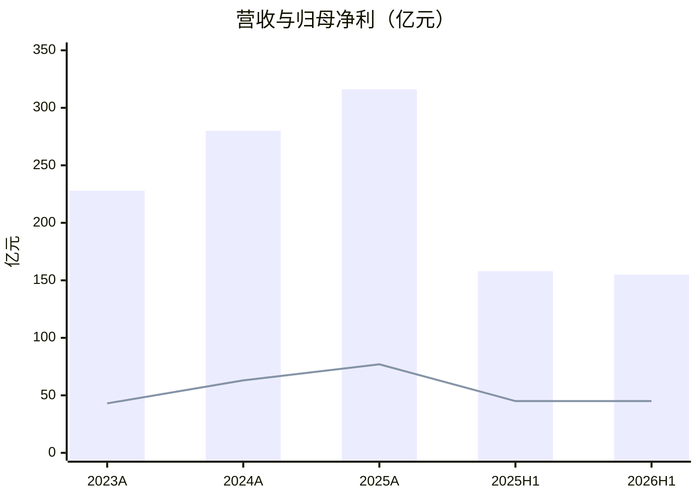
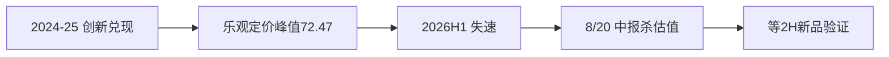
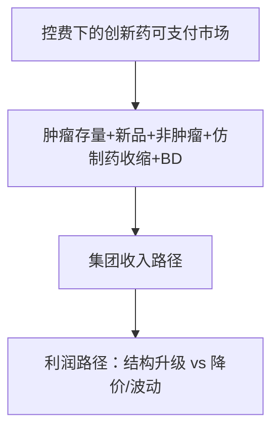
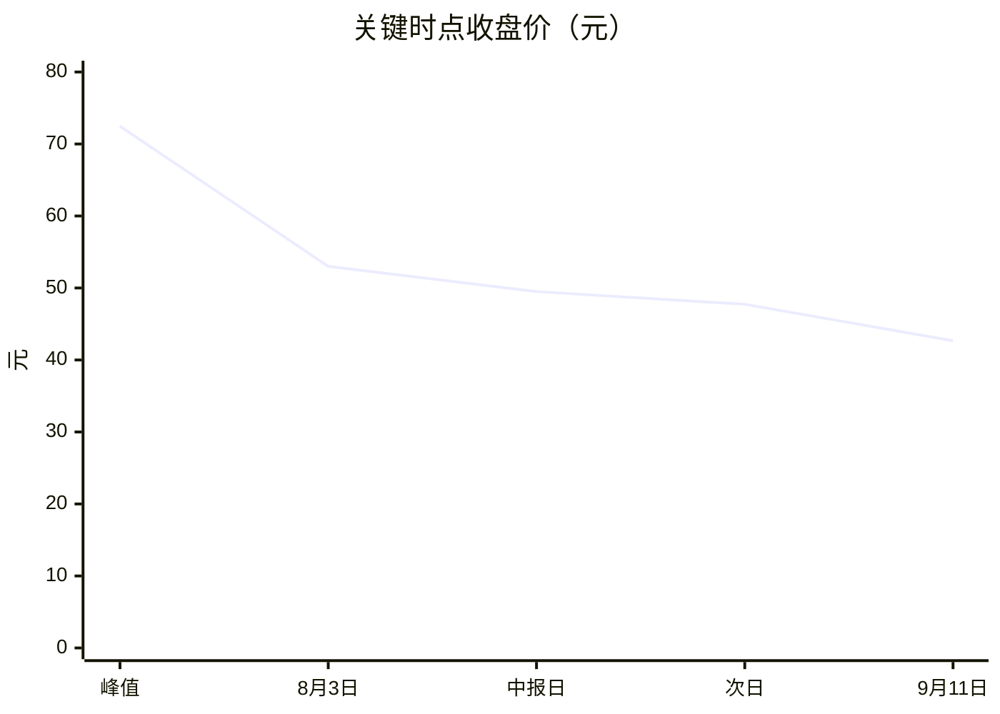

# 恒瑞医药（600276）投研报告

> 财务时点 **2026-06-30**；行情 **2026-09-11**（42.67 元 / 市值 2832.09 亿）；催化检索 **2026-09-11**。  
> 框架 **growth-tech-research**；估值路由 **A**。表图为主的合订本；证据见 `01`～`11` 与 `data/`。[回总览](./00-总览.md)  
> **不构成投资建议，不给出目标价或买卖指令。** 数字与 [02](./02-生意模式与财务画像.md) 对齐。

## 一句话判断

创新转型质地仍在（创新药占比过半并抬升），2026H1 收入与扣非失速冲击高增叙事；估值处历史极低分位、Forward PE~30，成长待再验证——质量尚可 × 斜率承压 × 中性定价。

---

## 一、投资摘要

**匹配：** 质量与现金底盘仍在，成长假设必须打折，估值相对历史已回归、相对增长并不送巨大安全垫。

读法：柱为营收、线为归母。年度抬升，但 2026H1 营收已低于 2025H1；归母持平含非经常，扣非 −12.7%。

| 项目 | 2023A | 2024A | 2025A | 2025H1 | 2026H1 |
|------|-------|-------|-------|--------|--------|
| 营收（亿元） | 228.2 | 279.85 | 316.29 | 157.61 | 154.56 |
| 营收同比 | +7.3% | +22.6% | +13.0% | +15.9% | **−1.94%** |
| 归母净利（亿元） | 43.02 | 63.37 | 77.11 | 44.50 | 44.65 |
| 归母同比 | +10.1% | +47.3% | +21.7% | +29.7% | +0.34% |
| 扣非归母 | — | — | 74.13（+20%） | — | **37.30（−12.71%）** |
| 毛利率 | 84.6% | 86.2% | 86.2% | 86.6% | 86.3% |
| 经营现金流 | 76.4 | 74.2 | 112.4 | 43.0 | **19.87** |

| 快照 | 数值 |
|------|------|
| PE TTM / 静态 PE / PB / PS | 36.65 / 31.71 / 4.39 / 9.04 |
| 5 年 PE/PB/PS 分位 | ~1.3% / ~0.1% / ~6.9% |
| 共识 EPS 26/27/28 | 1.41 / 1.65 / 1.96 |
| Forward PE / PEG | 30.3 / ~1.69（CAGR≈17.9%） |
| 自 2025-09-05 峰值回撤 | 72.47→42.67，约 **−41%** |

| 乐观 | 谨慎 |
|------|------|
| 创新占比 58%→63%；非肿瘤 +74% | 肿瘤创新 +2.58%；仿制药 −16% |
| 毛利率稳、销售费用率降、净现金厚 | 扣非与 CFO 恶化；归母含 Kailera FV ~8.21 亿 |
| 历史估值极低分位 | PEG~1.7 要求共识兑现 |

主矛盾：结构已变，斜率在掉；指引创新药 >30% 与 H1 +16.4% 落差是定价核心。

---

## 二、生意模式与财务画像

生意：处方药研发—注册—医院学术推广 + 创新药对外许可。高毛利（~86%）、高销售费用（~28%–33%）、高研发（~22%）。买方（医保）议价极强。

### 2025 分产品（医药制造业，亿元）

| 分产品 | 收入 | 同比 | 毛利率 | 占合计 |
|--------|------|------|--------|--------|
| 肿瘤 | 166.71 | +14.3% | **93.5%** | 59.5% |
| 神经科学 | 42.92 | +0.1% | 82.7% | 15.3% |
| 造影剂 | 29.93 | +8.9% | 58.8% | 10.7% |
| 代谢和心血管 | 24.36 | **+39.4%** | 73.7% | 8.7% |
| 免疫和呼吸 | 8.62 | +10.9% | 84.6% | 3.1% |
| 其他 | 7.59 | −11.8% | 54.2% | 2.7% |
| **合计** | **280.13** | +12.0% | **85.1%** | 100% |

读法：肿瘤压舱；代谢弹性最大；分产品合计低于合并营收 316.29——差额主要含许可 **33.92** 亿等。

### 创新药 / 仿制药 / 许可

| 口径 | 2025A | 2026H1 |
|------|-------|--------|
| 创新药销售 | 163.42（+26.1%，占 58.34%） | 88.09（+16.4%，占 63.16%） |
| 抗肿瘤创新 | 132.40（+18.5%） | 62.65（**+2.58%**） |
| 非肿瘤创新 | 31.02（+73.4%） | 25.45（**+74%**） |
| 仿制药 | 下滑 | 51.39（**−16.07%**） |
| 许可 | 33.92（+25.6%） | 14.22 vs 19.91（**−28.6%**） |

国内 266.66（+9.8%）/ 国外 13.48（+88.3%）。ROE 加权：2023 10.99% → 2024 14.73% → 2025 14.26%。货币资金 409.6→387.3 亿；H 股募资净额 102.85 亿；负债率 ~8%。

**强项：** 结构升级、费用效率、净现金。**隐患：** H1 收入负增、扣非与 CFO 裂口、肿瘤失速、BD 波动。详表见 [02](./02-生意模式与财务画像.md)。

---

## 三、近 1–2 年重大变化

结构三件事：创新占比跨越；H 股 + BD 进入利润公式；销售费用率下行。近端：2026H1 验证受挫，失速在 Q2（Q1 仍 +13%/+22%）。

| 时间 | 事件 | 类型 |
|------|------|------|
| 2024A | 营收 +22.6%，归母 +47.3%；创新药高增 | 结构 |
| 2025-05 | H 股上市，募资净额约 102.85 亿 | 结构 |
| 2025A | 创新药 163.42（占比 58.34%）；许可 33.92 | 结构确认 |
| 2025-09-05 | 股价峰值 72.47，PE~65 | 定价透支 |
| 2026Q1 | +13% / +21.8% | 周期偏正 |
| 2026H1 | 营收 −1.94%；扣非 −12.71%；肿瘤创新 +2.58% | 验证受挫 |
| 2026-08-20 | 中报日收盘 49.5，换手 3.74 | 预期差兑现 |

---

## 四、行业空间与竞争格局

| 维度 | 中性判断 |
|------|----------|
| 创新药可服务市场 | 总量中高速，单品天花板下移；控费硬约束 |
| 行业收入假设 | 高个位数～低双位数（供 Step 7） |
| 公司「创新药 +30%」 | 份额+新品进攻性指引，≠行业 beta |
| 集中度 CR3/CR5 | **未取得**统一口径 |
| 竞争形态 | 同靶点肉搏 + 价格/准入 |

对手（定位）：百济/信达/君实、科伦系、复星、跨国药企；凯莱英仅估值对照。同业 2025 毛利率/净利率：恒瑞 86.2%/24.4% vs 复星 50.1%/8.1%、科伦 47.8%/9.2%。

---

## 五、护城河与能力壁垒

| 五力 | 强度 |
|------|------|
| 现有竞争 / 替代品 / 购买者 | **强** |
| 潜在进入者 | 中 |
| 供应商 | 弱–中 |

**评级：** 平台 **中等偏宽**；单品/存量肿瘤 **偏窄**。变薄路径（已现）：医保续约降价、同靶点份额压力——H1 肿瘤创新 +2.58% 印证。

| 公司 | PE TTM | PB | PS |
|------|--------|-----|-----|
| 恒瑞 | 36.7 | 4.39 | 9.04 |
| 科伦 | 34.2 | 2.54 | 3.43 |
| 复星 | 17.0 | 1.18 | 1.35 |
| 凯莱英 | 57.2 | 3.34 | — |

---

## 六、管理层 · 研发 · 资本配置

| 指标 | 数值 |
|------|------|
| 2025 研发费用 | 69.61 亿（费用率 ~22%） |
| 2026H1 研发费用 | 34.93 亿 |
| 货币资金 / 负债率 | 387.3 亿 / ~8.2% |
| H 股募资净额 | 102.85 亿 |

自我造血，被动稀释压力低；近端矛盾是转化斜率 < 指引。回购逐笔、激励摊薄 fully diluted **未完整建模**。

---

## 七、成长路径与产品空间

| 模块 | 成熟度 | 中性逻辑 |
|------|--------|----------|
| 抗肿瘤创新 | 已贡献 | 个位数～低双位数 |
| 非肿瘤创新 | 验证中 | 高增后斜率回落 |
| 仿制药 | 收缩 | 继续负增 |
| BD | 期权 | 不线性外推 |
| 减重等 | 故事–早期 | **不计入中性上限** |

| 年度 | 收入增速中性 | 净利增速中性 | 对照 |
|------|--------------|--------------|------|
| 2026E | **+3%～+8%** | **+10%～+22%** | 共识净利约 +22% 靠上沿；公司创新药指引 >30% 更高 |
| 2027E | **+8%～+14%** | **+12%～+18%** | 新品接力假设 |
| 2028E | **+8%～+12%** | **+12%～+18%** | 期权不进上限 |

共识 EPS CAGR≈17.9%；本中性净利 CAGR 约 14%～18%。

---

## 八、现阶段估值（路由 A）

| 判定 | 结果 |
|------|------|
| 盈利且 PE TTM/Fwd ≤50 | **路由 A** |
| Forward PE 26/27/28 | **30.3 / 25.9 / 21.8** |
| PEG（30.3/17.9%） | **≈1.69** |
| 中性 CAGR 15% 时 PEG | ≈2.02 |

读法：峰值到当前约 −41%；中报日（8/20）是近端陡坡起点。

**路径回推（情景，非目标价）：** 若 2027 净利约 110 亿、给 28–35x，隐含市值约 3080–3850 亿 vs 今日 2832 亿——上行依赖倍数不继续压缩；若增长证伪给 20–25x，即便利润仍增股价可平淡。

相对历史：极低分位。相对增长：中性定价。相对同业：仍持创新溢价。

---

## 九、市场看法如何演变

| 阶段 | 主题 |
|------|------|
| 2024–25 上 | 转型兑现 |
| 2025 下–2026Q1 | 乐观透支（指引 >30%、峰值 PE~65） |
| 2026 中报后 | 增长再验证 |
| 2026-09 | 管线新闻托底，股价仍弱 |

研报样本 56：买入 47 / 增持 5 / 中性 3。8/24 浦银 **中性**「增长分化」；8/25 中邮买入「肿瘤承压」。卖方仍偏多，定价已杀估值——**预期差主导**。

---

## 十、近期大涨大跌归因

| 层 | 窗口 | 结论 |
|----|------|------|
| A 中期 | 峰值 72.47→42.67（−41%） | 框架从「创新高增溢价」切到「增长再验证」 |
| B 近端 | **2026-08-20 中报** | 营收 −1.94%、扣非 −12.71%、肿瘤 +2.58%；收盘 49.5、换手 **3.74** |

近端主因排序：（1）中报不及预期；（2）肿瘤存量失速坐实；（3）高 PE 压缩。公司特有为主，板块 beta 为辅。

| 日期 | 收盘 | 换手 |
|------|------|------|
| 2026-08-19 | 52.66 | 1.00 |
| **2026-08-20** | **49.50** | **3.74** |
| 2026-08-21 | 47.74 | 2.00 |
| 2026-09-11 | 42.67 | 1.26 |

---

## 十一、综合判断与跟踪清单

匹配状态：质量尚可 × 成长待验证 × 估值不再透支但也非巨大安全垫。

| 信号 | 看多确认 | 看空确认 |
|------|----------|----------|
| 集团收入 | 两季转正 | 两季负增 |
| 创新药 | 同比 ≥20%，向 >30% 靠拢 | 持续 <10% |
| 扣非 / CFO | 同比改善、缺口收敛 | 持续恶化 |
| 共识 EPS | 上修 | 下修致估值陷阱 |
| 催化 | 获批+放量 | FDA/集采重大负面 |

**前提：** 新品与非肿瘤接力；仿制药降幅可控；研发费用率不失控；无重大合规升级。  
**风险：** 肿瘤零增固化；BD 断崖；EPS 下修；新赛道价格战。

---

## 数据来源与缺口

| 来源 | 文件 |
|------|------|
| 行情 / 分位 / 价格路径 | `quotes.json`、`valuation_percentiles.json`、`price_path_400d.json` |
| 三表 / KPI | `sina_financials.json`、`derived_kpis.json` |
| 一致预期 / 研报 | `ths_eps.json`、`reports.json` |
| 催化 | `news.json`、`web_catalyst_notes.md`、公告 |
| 分部 / 创新药拆分 | 2025 年报、2026 中报经营评述（写入 02） |

**缺口：** 统一市占/CR、品种峰值销售、CapEx 精确序列、回购逐笔、部分 FDA 原文。

**免责声明：** 仅供研究整理，不构成投资建议。框架为 growth-tech-research，非价值龙头 PB-ROE，亦非平台 SOTP。
