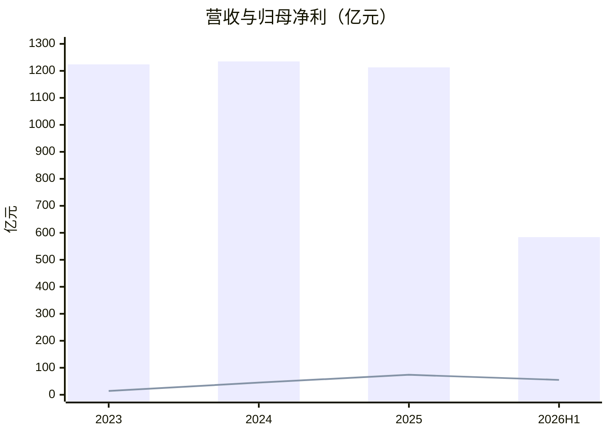

# 大唐发电（601991）投研总览

> 财务时点 2026-06-30；行情快照 2026-09-10；催化检索时点 2026-09-10。框架 value-leader-research 1.9.0。不构成投资建议。  
> 口语「大唐电力」对应上市主体 **大唐发电**（大唐国际发电股份有限公司）。

## 一句话判断

五大发电旗舰、近两年利润修复真实，但全国装机份额只有约 2%、电价仍在降；PE 看起来不贵，PB 已处五年约 93% 分位，五年均 ROE 为负，定增摊薄还压在头上。

## 关键指标

| 指标 | 数值 | 口径 / 时点 |
|------|------|-------------|
| 现价 / 总市值 | 5.88 元 / **1088 亿元** | 腾讯 2026-09-10 |
| PE TTM / PE 静 / PB | **13.08** / 9.88 / **2.89** | 同上 |
| 近 5 年 PE / PB 分位 | **30.2%** / **93.4%** | baostock 至 2026-09-09 |
| 2025 营收 / 归母 | 1213 亿 / **73.86 亿** | 年报 −1.8% / +63.9% |
| 2026H1 营收 / 归母 | 584 亿 / **55.09 亿** | 中报 +2.1% / +20.3% |
| 毛利率 2025 / 2026H1 | 19.08% / 19.29% | 新浪三表 |
| 五年加权 ROE 均值 / PB-ROE | **−1.65%** / **−0.57%** | 年报加权 ROE / 腾讯 PB |
| 一致预期 EPS 26/27/28 | 0.37 / 0.40 / 0.44 | 同花顺 9 家 |
| 前向 PE（2026E） | **15.9 倍** | 5.88 / 0.37 |
| 控股装机 / 全国份额（估） | 8.59 万 MW / **~2.1%** | 2026H1；全国约 40.4 亿 kW |
| 自高点回撤 | 9.18（2026-06-02）→ 5.83（09-09），**−36.5%** | baostock 收盘 |

## 关键图

读法：营收走平、利润爬升。2021–22 年归母为 −91 / −4 亿（亏损年无法画进从 0 起的 xychart），故从扭亏后的 2023 年起画。2026H1 已赚到 2025 全年的 75%。

交互看板（同套数）：[大唐发电投研看板](/Users/zengfanxi/.cursor/projects/Users-zengfanxi-Desktop-Project-skill-invest-skill/canvases/datang-value-research.canvas.tsx)

## 单独报告

扫读请打开 [大唐发电-投研报告.md](./大唐发电-投研报告.md)（表图为主）。分册仍是证据主件。

## 各章浓缩

| 章 | 结论 | 关键数字 | 分册 |
|----|------|----------|------|
| 摘要 | 利润修复真实，账面已被题材透支过一轮 | H1 +20%；PB 分位 93%；定增 ≤26.67 亿股 | [01](./01-投资摘要.md) |
| 基本面 | 收入几乎全是卖电；2025 利润靠煤机翻倍，H1 增量靠铝电+水电 | 电力销售 1051 亿；煤机利润 56→H1 26 亿（−17%）；铝电净利 8.06 亿 | [02](./02-基本面.md) |
| 1–2 年变化 | 周期修复为主；清洁装机与分红是弱结构 | 煤价 −14.8%；电价 −3.7%；定增 80 亿 | [03](./03-近1-2年重大变化.md) |
| 护城河 | **偏窄到中等**；寡头牌照，无定价权 | 上市份额 ~2%；H1 毛利率高于华能/华电 | [04](./04-竞争格局与护城河.md) |
| 成长 | 中性低于卖方；勿外推 2024–25 利润暴增 | 营收 +1%/+3%/+3%；归母 +11%/+5%/+5% | [05](./05-成长性预测.md) |
| 估值 | 盈利便宜、账面贵；PB-ROE 为负 | PE 13、分位 30%；PB 2.89 / 93%；PB-ROE −0.57% | [06](./06-现阶段估值.md) |
| 市场看法 | 卖方覆盖薄；股价交易过「算电」故事 | 东财研报仅 4 篇（2024）；5 月异常波动 +101% | [07](./07-市场看法如何演变.md) |
| 涨跌归因 | 中期是题材退潮+定增；近端未见急跌 | 5/6–6/2 翻倍；7/13 −9.94%；9 月无 ≥4% 日 | [08](./08-近期大涨大跌归因.md) |
| 综合跟踪 | 质量尚可、成长低、估值对 PB 不友好 | 盯全年归母 ≥80 亿、电价、定增落地、铝电利润 | [09](./09-综合判断与跟踪清单.md) |

## 目录

1. [一、投资摘要](./01-投资摘要.md)
2. [二、基本面](./02-基本面.md)
3. [三、近 1–2 年重大变化](./03-近1-2年重大变化.md)
4. [四、竞争格局与护城河](./04-竞争格局与护城河.md)
5. [五、成长性预测](./05-成长性预测.md)
6. [六、现阶段估值](./06-现阶段估值.md)
7. [七、市场看法如何演变](./07-市场看法如何演变.md)
8. [八、近期大涨/大跌归因](./08-近期大涨大跌归因.md)
9. [九、综合判断与跟踪清单](./09-综合判断与跟踪清单.md)

原始数据：`data/research_raw.json`。
