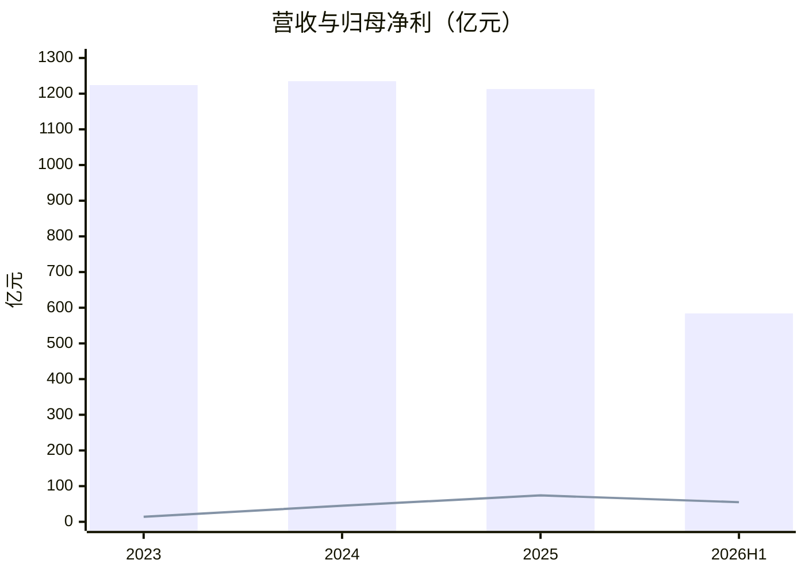
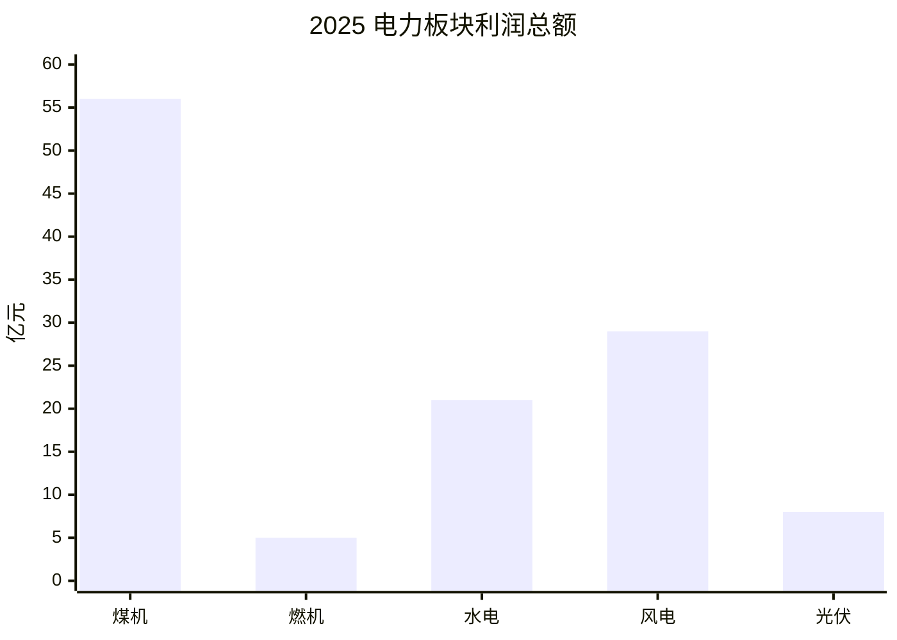
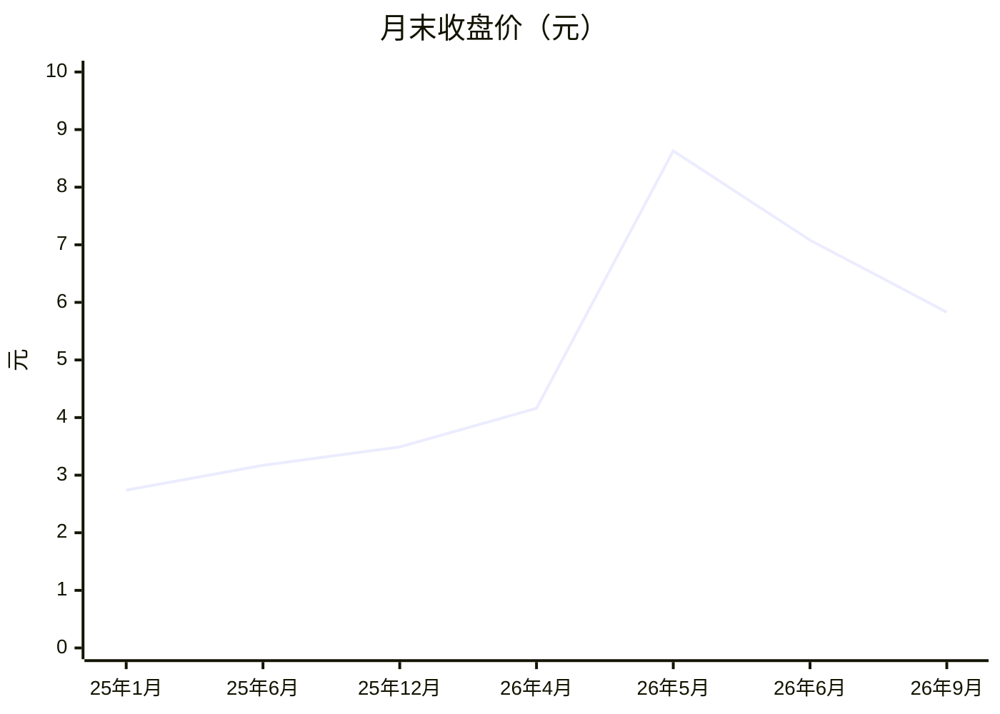

# 大唐发电（601991）投研报告

> 财务时点 2026-06-30；行情 2026-09-10（5.88 元 / 市值 1088 亿）；催化 2026-09-10。  
> 框架 value-leader-research 1.9.0。表图为主的合订本；证据见 `01`～`09` 与 `data/`。[回总览](./00-总览.md)  
> 口语「大唐电力」= 上市主体 **大唐发电**。不构成投资建议，不给出目标价或买卖指令。

## 一句话判断

利润修复真实、2026 年上半年还比同业强，但全国份额约 2%、电价仍在降；PE 处五年约 30% 分位，PB 已在 93% 分位，五年均 ROE 为负，80 亿定增压着股本。

---

## 一、投资摘要

**匹配：质量尚可，成长必须打折，估值对账面不友好。** 主要矛盾是「利润表修复」与「5 月题材把 PB 打到五年高位」叠在一起。

读法：柱为营收、线为归母。营收走平、利润爬升。2021–22 年归母为 −91 / −4 亿，xychart 不能画负值，故从 2023 年扭亏后起画。H1 已赚到 2025 全年的 75%，但 2025 年四季报只有约 6.7 亿，不能年化。

| 项目 | 2023 | 2024 | 2025 | 2026H1 |
|------|------|------|------|--------|
| 营收（亿元） | 1224 | 1235 | 1213 | 584 |
| 营收同比 | +4.8% | +0.9% | −1.8% | +2.1% |
| 归母净利（亿元） | 13.67 | 45.06 | 73.86 | 55.09 |
| 归母同比 | 扭亏 | +230% | +63.9% | +20.3% |
| 毛利率 | 11.75% | 14.87% | 19.08% | 19.29% |
| 粗算 FCF（亿元） | −6 | −44 | 95 | 35 |

| 快照 | 数值 |
|------|------|
| PE TTM / PB | 13.08 / 2.89 |
| 五年 PE / PB 分位 | 30% / **93%** |
| 前向 PE（一致预期 2026E EPS 0.37） | 15.9 倍 |
| 本报告中性 2025–28 净利 CAGR / PEG | ~7% / ~2.3 |
| 自 6/2 高点回撤 | **−36.5%** |
| 定增 | ≤26.67 亿股 / 80 亿元 |

| 乐观 | 谨慎 |
|------|------|
| 四大发电 H1 唯一归母正增长 | 电价 2025 −3.7%、H1 再 −3.0% |
| 水电 H1 利润 +43%；燃机翻倍 | 煤机 H1 利润 −17%；全国份额 ~2% |
| 2025 年 FCF 转正 | 净负债约 1538 亿；利息 44 亿 |
| PE 低于五年中位数 | PB-ROE −0.57%；定增摊薄 |

---

## 二、基本面

生意：上网电量 × 电价，减去燃料、折旧、利息；辅以供热和电解铝。客户是电网与市场化用户（约 86% 电量市场化）。

### 2025 分产品收入（年报主营，亿元）

| 分产品 | 收入 | 同比 | 毛利率 |
|--------|------|------|--------|
| 电力销售 | 1050.91 | −2.33% | 22.16% |
| 热力销售 | 65.79 | +4.67% | −52.69% |
| 其他产品 | 81.20 | +2.57% | 26.13% |

读法：收入 88% 是卖电。热力是保民生亏损块。铝不单列，落在「其他产品」。2026H1 分产品收入未披露。

### 电力利润总额（电厂加总，亿元）

| 板块 | 2025 | 同比 | 2026H1 | 同比 |
|------|------|------|--------|------|
| 煤机（含热） | 56.25 | +119% | 26.00 | −17.4% |
| 燃机（含热） | 4.66 | +37% | 4.21 | +226% |
| 水电 | 21.39 | +6.5% | 17.27 | +42.7% |
| 风电 | 29.44 | +38.5% | 15.69 | −19.0% |
| 光伏 | 7.71 | +9.8% | 2.52 | −37.6% |

读法：2025 年利润暴增是煤机（煤价）。2026H1 煤机已回落，水电和燃机在补；风光利润下滑。铝电（非分部）H1 净利 8.06 亿；其他分部利润总额 2.93→12.86 亿，贡献了公司利润总额增量的近全部。

装机仍是火电为主（煤 57% + 气 11%），清洁约 43%。上市公司装机约占全国 2.1%。

| | 2024 | 2025 | 2026H1 |
|--|------|------|--------|
| 净利率 | 3.65% | 6.09% | 9.43% |
| 年报加权 ROE | 10.44% | 18.15% | — |
| 账面杜邦（净利率×周转×乘数） | — | 6.1% × 0.37 × 4.18 ≈ 9.4% | — |
| 经营现金流（亿元） | 261 | 378 | 153（同比 −1.9%） |
| 利息费用（亿元） | 56.5 | 43.9 | 20.7 |

**高 ROE 来自杠杆和权益口径，不是净利率护城河。** 2026H1 净负债约 1538 亿，资产负债率 69.5%。

| 强项 | 隐患 |
|------|------|
| 经营现金流持续大于归母 | 利息与利润同一量级 |
| 2025 年 FCF 转正 | 2024 年 FCF 仍为 −44 亿 |
| 水电和气电提供利润韧性 | 煤机 H1 已 −17%；铝电 8 亿不可永续 |

---

## 三、近 1–2 年重大变化

**结构结论：赚钱方式没换，是煤价周期修复；定增是资本配置结构事件。**

| 时间 | 事件 | 周期 / 结构 |
|------|------|-------------|
| 2024–25 | 量平价跌、煤价大降，FCF 2025 转正 | 周期（主） |
| 清洁装机 → 43% | 水电 H1 利润 +43%；煤机 −17% | 弱结构 + 周期回吐 |
| 2026-05 | 算电/蒙电入苏，公司否认重组 | 叙事，非财报结构 |
| 2026-07-09 | 定增 80 亿扩煤电+补流 | 资本配置结构 |

---

## 四、竞争格局与护城河

评级：**偏窄到中等。**

| 对手 | 2026H1 归母 | 同比 | 毛利率 |
|------|-------------|------|--------|
| **大唐发电** | **55.09** | **+20.3%** | **19.29%** |
| 华能国际 | 65.86 | −28.9% | 17.42% |
| 华电国际 | 31.05 | −20.5% | 11.70% |
| 国电电力 | 30.14 | −18.3% | 14.22% |

五力：进入壁垒高（牌照），买方和煤都强，电是同质品。H1 利润率优于同业，支持「这一轮成本/水电更好」，2021 年毛利率 −0.75% 说明优势会随煤价消失。

变薄路径：现货电价再下、煤价反弹、定增扩煤电加重产能、铝价抽走利润。

---

## 五、成长性预测

禁止外推 2024–25 净利暴增。行业：用电量中性 +4–6%，电价缓降。公司营收五年已证明「量增价减」对冲后收入走平。

| 年度 | 行业收入（中性） | 公司营收 | 公司归母 | 归母（亿） | 假设 |
|------|------------------|----------|----------|------------|------|
| 2026 | +2%～+4% | **+1%** | **+11%** | **82** | H1 55 + H2≈27；不年化 |
| 2027 | +3% | **+3%** | **+5%** | **86** | 利润率不再扩张 |
| 2028 | +3% | **+3%** | **+5%** | **90** | 定增机组开始贡献电量 |

| | 2026 | 2025–28 CAGR |
|--|------|------|----------------|
| 一致预期（9 家 EPS） | +17% | ~12% |
| 本报告中性 | +11% | **~7%** |

差在：卖方仍给修复惯性；本报告写入电价、Q4 季节性和铝电不可永续。

---

## 六、现阶段估值

读法：2026 年 5 月从公用事业价格变成主题股价格；9 月回到 5.8 附近，仍高于 2025 年的 3.5。

| 尺子 | 数值 | 相对什么 |
|------|------|----------|
| PE TTM 13.08 | 五年分位 30% | 自身盈利倍数：中偏低 |
| PB 2.89 | 五年分位 **93%** | 自身账面：贵 |
| 同业 PB | 华能 1.70 / 华电 1.14 / 国电 1.57 | 组内最高 |
| 前向 PE | 15.9 倍 | 相对 7% 增长：不便宜 |
| **PB-ROE** | 五年均 ROE −1.65% / 2.89 = **−0.57%** | 平滑亏损年后为负 |

五年加权 ROE：−29.56%、−6.23%、−1.03%、10.44%、18.15%。PE 与 PB-ROE 背离，是因为 PE 用近 12 个月高利润，PB-ROE 用五年平均。

---

## 七、市场看法

东财可抓研报仅 4 篇且停在 2024 年，覆盖薄。叙事四段：煤电修复（2024–25）→ 算电题材（2026-04–06）→ 定增退潮（7–8 月）→ 相对同业优势再定价（中报后）。卖方 EPS 路径高于本报告；股价已不按 9 元题材交易，但 PB 仍明显高于 2025 年。

---

## 八、近期涨跌归因

| 层 | 窗口 | 幅度 | 主因 |
|----|------|------|------|
| A 中期 | 6/2 高点 9.18 → 9/9 的 5.83 | **−36.5%** | ① 5 月算电溢价退潮（5/19 异常波动公告）② **7/9 定增 80 亿** ③ 估值从 PE~20 压回 13 |
| B 近端 | 9/1–9/10 | **未见收盘 ≥4% 急跌** | 无新导火索；9/10 媒体「唯一正增长」是中报滞后传播 |

可指名：5/6 起涨停（中卫光伏 + 蒙电入苏）；7/13 −9.94%（定增后第四日）；7/20 +10%（电量 +4.42%）；8/20 定增获受理。上涨催化是题材和电量，下跌催化是股本供给，不是中报塌了。

---

## 九、综合与跟踪

中性前提：煤价不暴涨、电价降幅收在约 5% 内、来水不崩、定增不立刻按上限摊薄全年。

| 信号 | 看多确认 | 看空确认 |
|------|----------|----------|
| 利润 | 2026 归母 ≥80 亿 | 全年 <70 亿 |
| 电价/煤价 | 均价降幅收窄 | 均价再降 >5% 且煤价升 |
| 定增 | 规模下修或集团认购上修 | 深折价按上限发行 |
| 估值 | PB 回到五年中枢、ROE 维持双位数 | PB~3 而 ROE 回落个位数 |

完整分册与原始抓取：`reports/601991-大唐发电/`。
